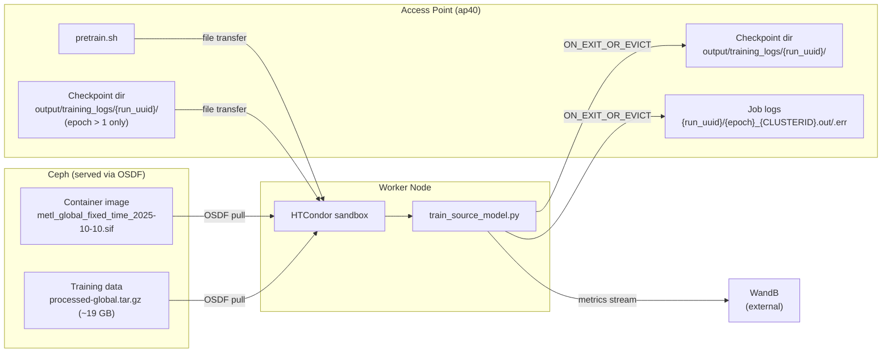
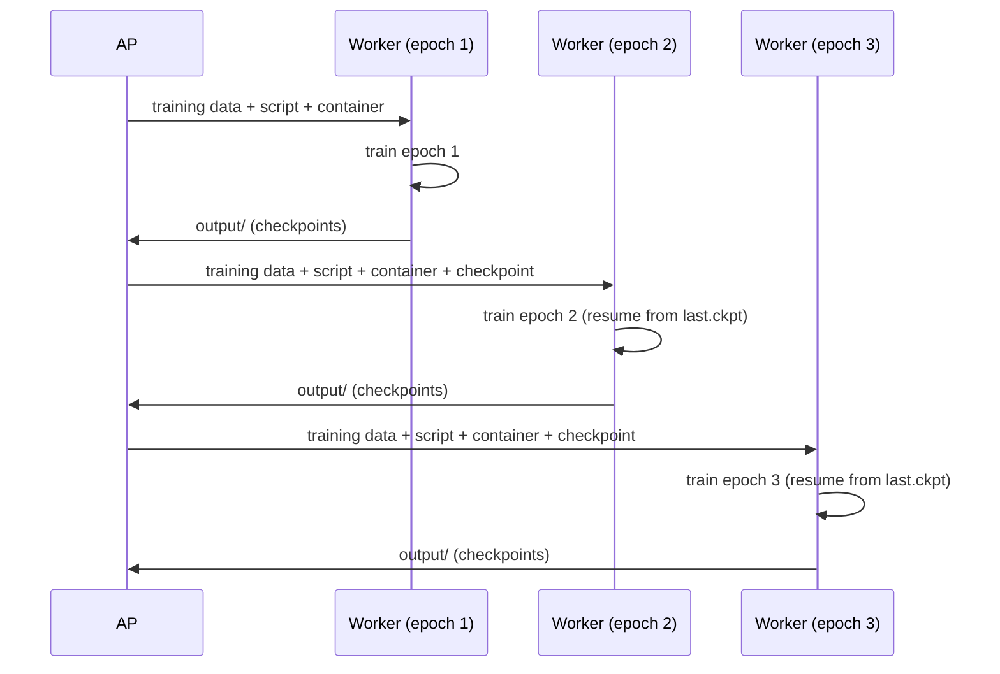

# PATh-NAIRR Demonstration Project Data Flow

This document describes how data moves through the model training workflows
within the "Throughput Machine Learning with Heterogenous Resources" project. It
describes what the data components are, where they are stored, and how they are
moved into and out of the computing nodes.

## Overview

The DAG runs multiple independent training runs in parallel (e.g., run0, run1,
run2). Each run trains a global METL source model for 30 epochs. Epochs within a
run are strictly sequential: epoch N+1 cannot start until epoch N completes and
its checkpoint is safely back on the AP. Across runs, there is no dependency —
they proceed independently with different random seeds.

Each epoch is a single HTCondor job. Jobs can land on heterogeneous compute
resources: Glideins within the OSPool, or HTCondor annexes started within NAIRR
sites (Expanse, Anvil, Delta, Bridges2 and AWS). Barring minor resource request
changes dependent on site particularities, the job description and data transfer
are the same regardless of target.

---

## Storage Locations

| Location | What lives there |
|---|---|
| `ap40` CEPH storage, via OSDF (`osdf:///ospool/ap40/data/ian.ross/`) | Ceph storage attached to `ap40`, served via OSDF caching layer |
| `ap40` working directory | `pretrain.sh` script, `output/` checkpoint dirs |
| Worker node scratch | Ephemeral job sandbox during execution |
| Weights and Biases | Training metrics (streamed live during each job, if enabled) |

The container image and training data are stored on the AP filesystem and served to workers via
OSDF, which provides distributed caching across the OSPool fabric. The script and checkpoints move
via HTCondor's standard file transfer.

---

## Inputs Per Job

### Always transferred (every epoch)

| Artifact | Size | Source | Mechanism |
|---|---|---|---|
| Container image (`metl_global_fixed_time_2025-10-10.sif`) | 5.7 GB | Ceph storage via OSDF (`osdf:///ospool/ap40/data/ian.ross/`) | OSDF pull by HTCondor |
| Training data (`processed-global.tar.gz`) | 19 GB | Ceph storage via OSDF (`osdf:///ospool/ap40/data/ian.ross/`) | OSDF pull by HTCondor |
| Training script (`pretrain.sh`) | 1 kB| AP working directory | HTCondor file transfer |

### Conditionally transferred (epoch > 1)

| Artifact | Source | Mechanism |
|---|---|---|
| Checkpoint directory (`output/training_logs/{run_uuid}/`) | AP working directory | HTCondor file transfer |

The checkpoint directory contains `.ckpt` files (one per completed epoch, keyed
by epoch/step/val loss) plus `last.ckpt` and a `time_checkpoints/` subdirectory
used for mid-epoch eviction recovery. The METL training software will resume
training from the the "best" checkpoint so far, falling back to `last.ckpt` in
cases where "best" checkpoint was not successfully transferred on the AP. This
happened due to quota constraints on the AP resulting in successful update of
the existing `last.ckpt` weight file, but the epoch-specific file could not be
written back.

---

## Outputs Per Job

| Artifact | Size | Destination on AP | Contents |
|---|---|---|---|
| `output/training_logs/{run_uuid}/checkpoints/` | 230MB | AP working directory | Per-epoch `.ckpt` files, `last.ckpt`, `time_checkpoints/` |
| HTCondor stdout/stderr | ~20MB  | `{run_uuid}/{epoch}_{CLUSTERID}.out/.err` | Job logs |
| HTCondor log | - |  `metl.log` | Job lifecycle events |
| Metrics | WandB (external) | ~20MB | Live monitoring, loss curves, learning rate, etc. |

After all 30 epochs complete, the final checkpoints for a run are at
`output/training_logs/{run_uuid}/checkpoints/` on the AP. Completed runs are
also synced via cronjob on the AP to Ceph storage (`/ospool/ap40/data/ian.ross/global_checkpoints/`) for redundancy.

---

## What Happens on the Worker

1. HTCondor unpacks the job sandbox. The container image is already cached (or pulled via OSDF).
2. `pretrain.sh` runs inside the container:
   - Untars `processed-global.tar.gz` into `global/` then deletes the tarball to reclaim disk
   - Symlinks code in the container image (`/workspace/metl/data/`) to the working directory
   - Runs `train_source_model.py` with hyperparameters from METL repository, stored within the container image in `/workspace/metl/args/pretrain_global.txt`,
     passing epoch number, `run_uuid`, and random seed
3. Training streams metrics to WandB via API key set in the job environment.
4. On completion **or eviction**, HTCondor transfers the `output/` directory back to the AP.

---

## Other notes
Each runs' checkpoints directory was periodically manually pruned to minimize
movement of unnecessary epoch checkpoint files, as early weights files soon
become obsolete in the training mechanism.

---

## Data Flow Diagrams

### Per-epoch job data flow

### Epoch-to-epoch checkpoint chain (within one run)

